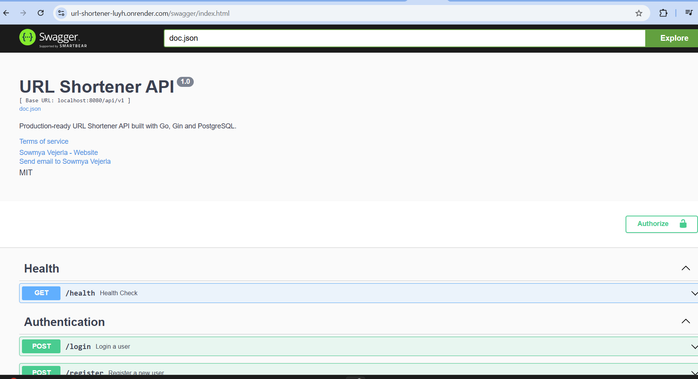

# URL Shortener Service

A production-ready URL Shortener REST API built with **Go**, **Gin**, **PostgreSQL**, and **Clean Architecture**.

---

## 🚀 Tech Stack

* Go
* Gin
* PostgreSQL
* pgx
* JWT Authentication
* Docker Compose
* Viper
* Clean Architecture

---

## 📁 Project Structure

```text
cmd/
docs/
internal/
    config/
    database/
    dto/
    handler/
    middleware/
    model/
    repository/
    routes/
    service/
migrations/
pkg/
tests/
```

---

## ✨ Features

### Authentication

* User Registration
* User Login
* JWT Authentication
* Password Hashing using bcrypt
* Protected Routes

### URL Management

* Create Short URL
* Redirect using Short Code
* Get User URLs
* Delete User URL
* Click Count Tracking
* Duplicate URL Detection

### Production Features

* Clean Architecture
* Repository Pattern
* Service Layer
* DTOs
* PostgreSQL Integration
* Structured Logging (`log/slog`)
* Environment Configuration using Viper
* Configuration Validation
* Graceful Server Shutdown
* Docker Compose for PostgreSQL

---

## 📌 API Endpoints

### Authentication

| Method | Endpoint           | Description         |
| ------ | ------------------ | ------------------- |
| POST   | `/api/v1/register` | Register a new user |
| POST   | `/api/v1/login`    | Login user          |

### URL

| Method | Endpoint           | Description              |
| ------ | ------------------ | ------------------------ |
| POST   | `/api/v1/shorten`  | Create Short URL         |
| GET    | `/api/v1/urls`     | Get User URLs            |
| DELETE | `/api/v1/urls/:id` | Delete URL               |

## Public Redirect Endpoint

| Method | Endpoint           | Description              |
| ------ | ------------------ | ------------------------ |
| GET    | `/:shortCode`      | Redirect to Original URL |
---

## ⚙️ Environment Variables

Create a `.env` file:

```env
APP_NAME=URL Shortener
APP_ENV=development
APP_PORT=8080

DB_HOST=localhost
DB_PORT=5432
DB_USER=postgres
DB_PASSWORD=postgres
DB_NAME=url_shortener
SSL_MODE=disable

JWT_SECRET=your-secret-key
JWT_EXPIRY=24h
```

---

## ▶️ Run Locally

Start PostgreSQL

```bash
docker compose up -d
```

Run the application

```bash
go run ./cmd/api
```

---

## 🧪 Project Status

### ✅ Completed

* Project Bootstrap
* Configuration Management
* PostgreSQL Integration
* JWT Authentication
* Password Hashing
* Authentication Middleware
* URL Shortening
* URL Redirection
* Click Count Tracking
* Get User URLs
* Delete URL
* Duplicate URL Detection
* Repository Pattern
* Service Layer
* DTO Mapping
* Structured Logging
* Configuration Validation
* Graceful Shutdown

### 🚧 Planned

* Swagger / OpenAPI Documentation
* Unit Tests
* Integration Tests
* Dockerize Go Application
* GitHub Actions CI/CD

---


## 📷 Screenshots

### Swagger UI



## 📄 License

This project is licensed under the MIT License. See the `LICENSE` file for details.
